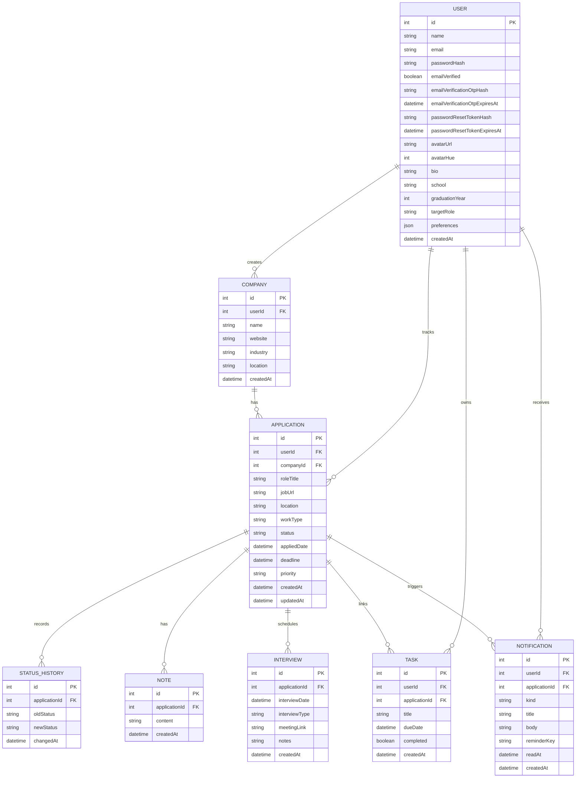

# InternFlow ERD

```mermaid
erDiagram
    USER ||--o{ COMPANY : creates
    USER ||--o{ APPLICATION : tracks
    USER ||--o{ TASK : owns
    USER ||--o{ NOTIFICATION : receives
    COMPANY ||--o{ APPLICATION : has
    APPLICATION ||--o{ STATUS_HISTORY : records
    APPLICATION ||--o{ NOTE : has
    APPLICATION ||--o{ TASK : links
    APPLICATION ||--o{ INTERVIEW : schedules
    APPLICATION ||--o{ NOTIFICATION : triggers

    USER {
        int id PK
        string name
        string email
        string passwordHash
        boolean emailVerified
        string emailVerificationOtpHash
        datetime emailVerificationOtpExpiresAt
        string passwordResetTokenHash
        datetime passwordResetTokenExpiresAt
        string avatarUrl
        int avatarHue
        string bio
        string school
        int graduationYear
        string targetRole
        json preferences
        datetime createdAt
    }

    COMPANY {
        int id PK
        int userId FK
        string name
        string website
        string industry
        string location
        datetime createdAt
    }

    APPLICATION {
        int id PK
        int userId FK
        int companyId FK
        string roleTitle
        string jobUrl
        string location
        string workType
        string status
        datetime appliedDate
        datetime deadline
        string priority
        datetime createdAt
        datetime updatedAt
    }

    STATUS_HISTORY {
        int id PK
        int applicationId FK
        string oldStatus
        string newStatus
        datetime changedAt
    }

    NOTE {
        int id PK
        int applicationId FK
        string content
        datetime createdAt
    }

    TASK {
        int id PK
        int userId FK
        int applicationId FK
        string title
        datetime dueDate
        boolean completed
        datetime createdAt
    }

    INTERVIEW {
        int id PK
        int applicationId FK
        datetime interviewDate
        string interviewType
        string meetingLink
        string notes
        datetime createdAt
    }

    NOTIFICATION {
        int id PK
        int userId FK
        int applicationId FK
        string kind
        string title
        string body
        string reminderKey
        datetime readAt
        datetime createdAt
    }
```
