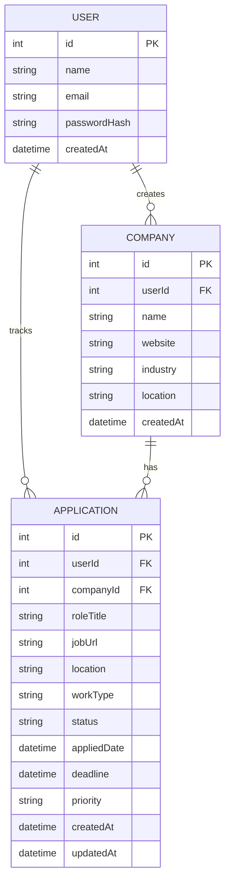

# Internship Tracker ERD

```mermaid
erDiagram
    USER ||--o{ COMPANY : creates
    USER ||--o{ APPLICATION : tracks
    COMPANY ||--o{ APPLICATION : has

    USER {
        int id PK
        string name
        string email
        string passwordHash
        datetime createdAt
    }

    COMPANY {
        int id PK
        int userId FK
        string name
        string website
        string industry
        string location
        datetime createdAt
    }

    APPLICATION {
        int id PK
        int userId FK
        int companyId FK
        string roleTitle
        string jobUrl
        string location
        string workType
        string status
        datetime appliedDate
        datetime deadline
        string priority
        datetime createdAt
        datetime updatedAt
    }
```